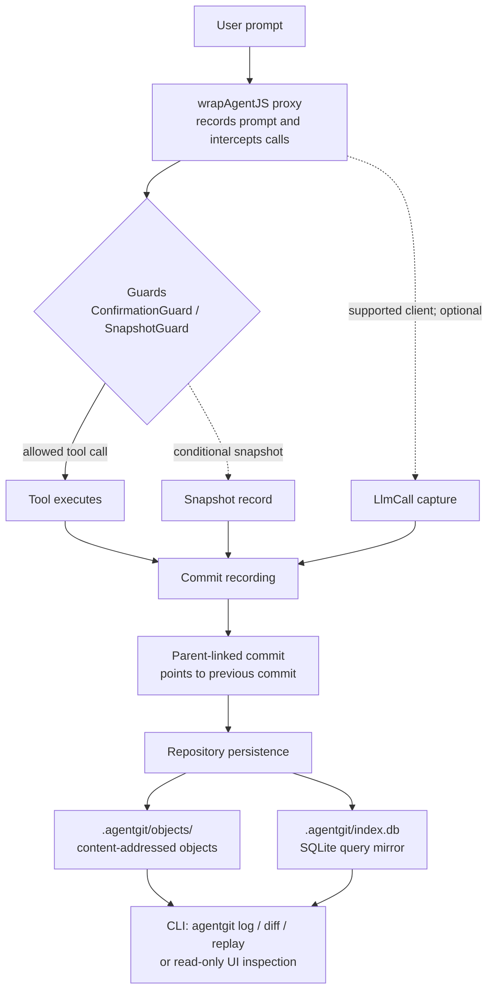

# AgentGit

> **Local-first Git for AI agents.** Record prompts, tool calls, and state snapshots as a local, content-addressed commit log.

[](https://github.com/agentgit/agentgit/actions)
[](#)
[](#license)
[](https://nodejs.org/)
[](https://pnpm.io/)

## 60-second pitch

AI agents change files, call tools, and invoke LLMs for reasoning. AgentGit
captures those LLM calls (prompt messages, model response, token usage, and
estimated cost) as first-class `LlmCall` commits alongside tool calls. Most runs
disappear into console logs; AgentGit gives each run a Git-like audit trail under
`.agentgit/`: immutable objects, parent-linked commits, SQLite-backed queries,
and replay/export commands you can use without a server.

Use it when you need to answer: what prompt started this run, which tool calls
and LLM reasoning steps happened, what changed between steps, and can this
session be replayed or archived later?

## Install

```bash
npm install -g @agentgit/cli && npm install @agentgit/sdk
```

From a source checkout:

```bash
pnpm install
pnpm build
pnpm --filter @agentgit/cli exec agentgit init
```

## Wrap Your Agent

```ts
import { wrapAgentJS } from "@agentgit/sdk";

class Agent {
  // `llm` property is auto-detected by wrapAgentJS({ llm: true }) for Anthropic / Vercel AI clients
  llm: any = null;

  async run(prompt: string) {
    await this.search({ query: prompt });
    return { ok: true };
  }
  async search({ query }: { query: string }) {
    return [`result for ${query}`];
  }
}
const wrapped = wrapAgentJS(new Agent(), { repoDir: ".agentgit", sessionName: "demo" });
await wrapped.run("Summarize the repo");
wrapped.agentgit.end();
```

Inspect the result:

```bash
agentgit log
agentgit diff <hash1> <hash2>
agentgit replay demo
agentgit export demo > demo.agentgit.json
```

## How AgentGit Works

`wrapAgentJS` creates a proxy and a local session, then turns the prompt and
completed agent steps into parent-linked, content-addressed commits. Before an
intercepted tool runs, guards such as `ConfirmationGuard` and `SnapshotGuard`
evaluate it; snapshots are recorded only when a configured guard applies.
Supported LLM clients can also contribute optional `LlmCall` records.

The repository keeps everything local under `.agentgit/`: immutable,
SHA-256-addressed data lives in `.agentgit/objects/`, while
`.agentgit/index.db` is a SQLite query mirror. The CLI and read-only UI reopen
that history for inspection and replay.



See the [detailed architecture](./docs/architecture.md) for the object schema,
recording sequence, and repository invariants.

## Feature Matrix

| Built | Planned |
| --- | --- |
| `agentgit init`, `log`, `diff`, `branch`, `checkout`, `replay`, `export` | Remote sync and shared stores |
| Content-addressed object store with canonical-JSON SHA-256 hashes | Merge model and conflict UX |
| SQLite mirror index with WAL, FK checks, and migrations | `agentgit gc` and `agentgit fsck` |
| TypeScript SDK with `wrapAgentJS` and manual sessions | Portable bundle format and hosted web viewer |
| Python adapter and LangChain callback handler | Expanded adapter coverage |
| `LlmCall` first-class commit type (model/tokens/cost) + auto-capture for Anthropic SDK, Vercel AI SDK, Python LLM SDKs | |
| Default `ConfirmationGuard` and `SnapshotGuard` | Performance API, telemetry, and CI hardening |
| Tauri read UI for timeline, diffs, and blame | UI write actions |

## Privacy

AgentGit emits no telemetry by default. Nothing leaves your machine
unless you explicitly opt in by setting `telemetry.enabled = true` in
`.agentgit/config.json`.

When telemetry is on, the configured reporter (console by default,
OTLP available as an opt-in) receives ONLY:

- span name (one of: `commit`, `guard.evaluate`, `objectstore.write`,
  `objectstore.read`, `index.transaction`),
- duration in milliseconds,
- span-specific benign attributes (never user data or identifiers):
  - `commit`: `{ entries: number, signed: boolean }`
  - `guard.evaluate`: `{ outcome: "allow" | "block", guards: number }`
  - `objectstore.write`: `{ deduped: boolean }`
  - `objectstore.read`, `index.transaction`: no attrs (`{}`)

Reporters MUST NOT receive: commit messages, tool names, tool inputs or
outputs, file paths, file contents, session IDs, hashes, or any other
user-supplied data. The privacy contract (matching the exact emitted
attributes) is documented on the `Reporter` / `Span` interfaces in
`packages/core/src/telemetry/reporter.ts`. See also
[docs/semver-policy.md](./docs/semver-policy.md) for the public-API
surface contract.

## Documentation

- [Quickstart](./docs/quickstart.md) - install, wrap, run, log, diff, replay.
- [Architecture](./docs/architecture.md) - object store, ER diagram, sequence flow, and invariants.
- [Troubleshooting](./docs/troubleshooting.md) - locking, corrupted stores, symlinks, large blobs, Windows paths, and size management.
- [CLI reference](./docs/cli-reference.md)
- [SDK API](./docs/sdk-api.md)
- [Adapters](./docs/adapters.md)
- [Safety guards](./docs/safety-guards.md)
- [Replay export](./docs/replay-export.md)

Run the docs site locally:

```bash
pnpm docs:dev
```

## Repository Layout

```text
packages/core       object store, SQLite index, commit graph, migrations
packages/cli        commander-based CLI
packages/sdk        TypeScript wrapper and manual session API
packages/ui         Tauri + React desktop app
adapters/python     Python drop-in adapter
adapters/langchain  LangChain callback handler
examples/           working end-to-end examples
docs/               VitePress documentation site
```

## License

MIT.
